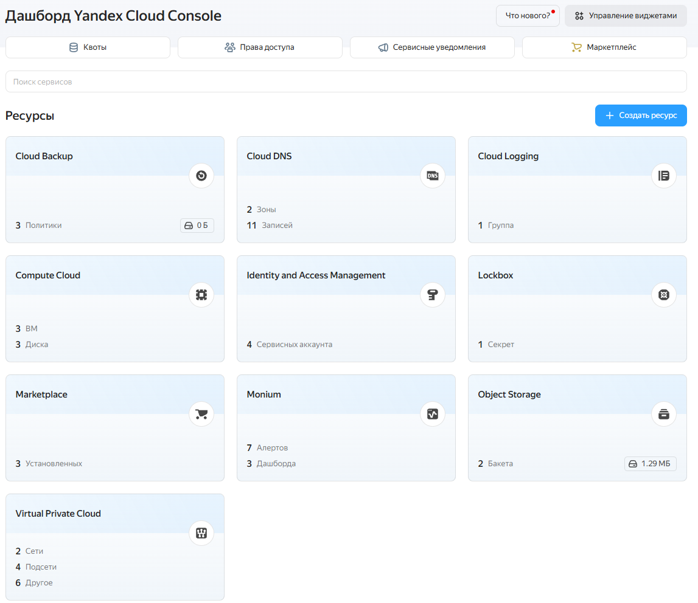
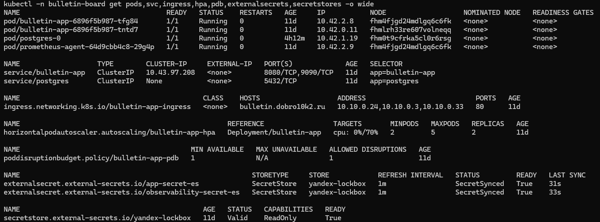
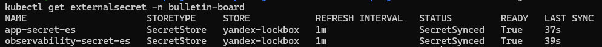
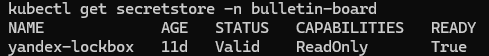
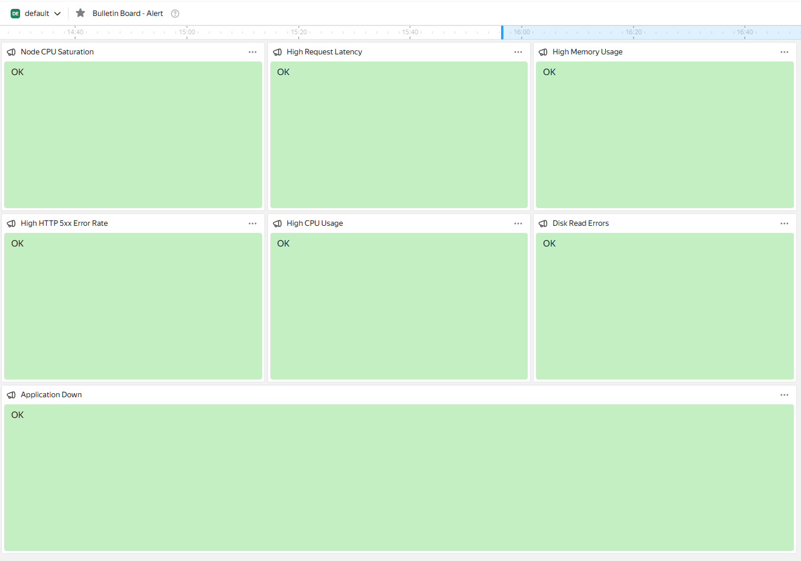
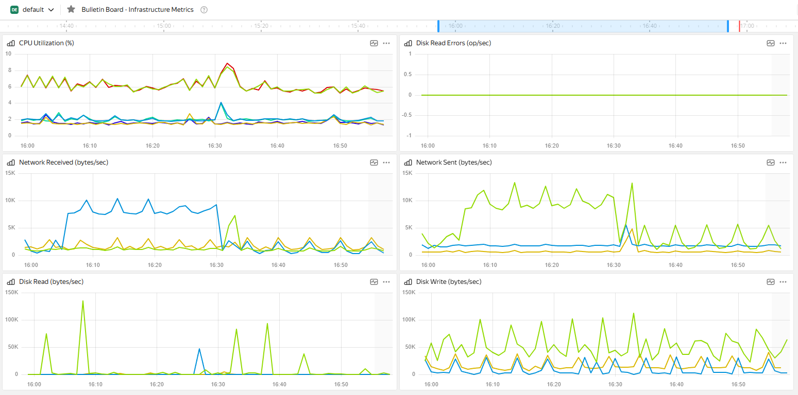
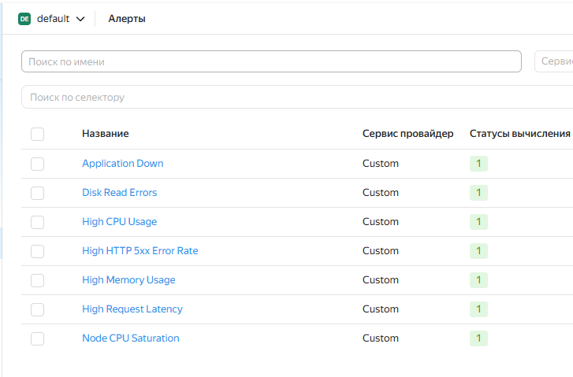

### Hexlet tests and linter status:
[](https://github.com/dobro10k2/devops-engineer-from-scratch-project-319/actions)
[](https://github.com/dobro10k2/devops-engineer-from-scratch-project-319/actions)

# DevOps Engineer From Scratch — Bulletin Board on Kubernetes

Production-ready infrastructure for the Spring Boot "Bulletin Board" application deployed in Yandex Cloud.

The project includes:

- Terraform Infrastructure as Code
- Kubernetes cluster based on K3s
- Helm chart deployment
- CI/CD with GitHub Actions
- External Secrets Operator + Yandex Lockbox
- Object Storage integration
- Monitoring with Managed Prometheus
- Centralized logging with Cloud Logging
- Zero-downtime deployments
- Horizontal Pod Autoscaler (HPA)
- PodDisruptionBudget (PDB)
- Rolling updates with health checks
- Automated secret synchronization and rotation

---

# Technology Stack

| Component | Technology |
|---|---|
| Cloud Provider | Yandex Cloud |
| Container Orchestration | Kubernetes (K3s) |
| Infrastructure Provisioning | Terraform |
| Package Management | Helm v3 |
| CI/CD | GitHub Actions |
| Secret Management | Yandex Lockbox + External Secrets Operator |
| Monitoring | Prometheus Agent + Managed Prometheus |
| Logging | Fluent Bit + Yandex Cloud Logging |
| Database | PostgreSQL |
| Object Storage | Yandex Object Storage |
| Container Registry | GitHub Container Registry |

---

# Architecture

Instead of using Managed Kubernetes and Managed PostgreSQL, the infrastructure is fully deployed on dedicated virtual machines in Yandex Cloud.

Infrastructure components:

- 1 K3s master node
- 2 K3s worker nodes
- PostgreSQL inside Kubernetes StatefulSet
- Spring Boot application inside Kubernetes
- Yandex Object Storage
- Yandex Lockbox
- Yandex Managed Prometheus
- Yandex Cloud Logging
- Fluent Bit DaemonSet
- Prometheus Agent

---

# Project Structure

```text
.
├── .github/
│   └── workflows/
│       ├── deploy.yml
│       └── hexlet-check.yml
│
├── k8s/
│   ├── bulletin-board/
│   │   ├── Chart.yaml
│   │   ├── values.yaml
│   │   └── templates/
│   │       ├── configmap.yaml
│   │       ├── deployment.yaml
│   │       ├── external-secret-monitoring.yaml
│   │       ├── external-secret.yaml
│   │       ├── hpa.yaml
│   │       ├── ingress.yaml
│   │       ├── pdb.yaml
│   │       ├── postgres-service.yaml
│   │       ├── postgres-statefulset.yaml
│   │       ├── secret-store.yaml
│   │       └── service.yaml
│   │
│   ├── monitoring/
│   │   └── prometheus-agent.yaml
│   │
│   └── namespace.yaml
│
├── terraform/
│   ├── backend.tf
│   ├── compute.tf
│   ├── network.tf
│   ├── observability.tf
│   ├── lockbox.tf
│   ├── outputs.tf
│   ├── providers.tf
│   ├── security.tf
│   ├── storage.tf
│   ├── variables.tf
│   ├── versions.tf
│   ├── terraform.tfvars.example
│   └── cloud-init/
│       ├── master.yaml
│       └── worker.yaml
│
├── Makefile
└── README.md
```

---

# Requirements

Local environment:

- Linux/macOS
- Terraform >= 1.5
- kubectl
- Helm
- yc CLI
- Docker
- make
- Git

---

# Application

🌐 **Live Website:** [http://bulletin.dobro10k2.ru/](http://bulletin.dobro10k2.ru/)

Source application repository:
<https://github.com/dobro10k2/project-devops-deploy>

Docker image:

```bash
ghcr.io/dobro10k2/project-devops-deploy:latest
```

---

# Infrastructure Provisioning (Terraform)

Terraform provisions:

- Compute instances
- VPC network
- NAT gateway
- Security groups
- K3s cluster
- Object Storage bucket
- Lockbox secrets
- Monitoring resources
- IAM service accounts
- Logging infrastructure

---

# Terraform Commands

## Initialize Terraform

```bash
make tf-init
```

## Review execution plan

```bash
make tf-plan
```

## Apply infrastructure

```bash
make tf-apply
```

## Destroy infrastructure

```bash
make tf-destroy
```

## Print outputs

```bash
make tf-outputs
```

---

# terraform.tfvars Example

```hcl
cloud_id       = "YOUR_CLOUD_ID"
folder_id      = "YOUR_FOLDER_ID"
yc_token       = "YOUR_YC_TOKEN"
ssh_public_key = "YOUR_SSH_PUBLIC_KEY"
bucket_name    = "YOUR_BUCKET_NAME"
prometheus_workspace_id = "YOUR_WORKSPACE_ID"
```

---

# Kubernetes Access

Download kubeconfig:

```bash
make k8s-get-config
```

Export kubeconfig:

```bash
export KUBECONFIG=~/.kube/config-k3s
```

---

# Secret Management (Yandex Lockbox + ESO)

To follow modern security practices:

- No secrets are stored in Git
- No hardcoded passwords exist inside Helm values
- All sensitive data is stored inside Yandex Lockbox

The project uses:

- SecretStore
- ExternalSecret
- External Secrets Operator (ESO)

Terraform automatically:

- Generates secure random passwords
- Creates S3 access keys
- Creates application secrets
- Stores all values inside Lockbox

Inside Kubernetes:

- ESO authenticates using a dedicated Service Account
- Secrets are synchronized every 60 seconds
- Kubernetes Secrets are automatically recreated

Generated Kubernetes secrets:

- `app-secret`
- `observability-secret`

---

# Secret Rotation Procedure

## 1. Open Yandex Cloud Lockbox

Navigate to:

```text
Yandex Cloud Console → Lockbox
```

## 2. Create New Secret Version

Update secret values such as:

- APP_SECRET
- DB_PASSWORD
- S3_SECRET_KEY

Save the new version.

## 3. Verify Synchronization

```bash
kubectl describe secret app-secret -n bulletin-board
```

ESO automatically synchronizes new values within 60 seconds.

## 4. Restart Application Pods

Spring Boot reads environment variables during startup, so perform a rolling restart:

```bash
kubectl rollout restart deployment/bulletin-app -n bulletin-board
```

The restart occurs without downtime.

---

# Helm Deployment

## Local Deployment

```bash
make helm-deploy
```

## Rollback Release

```bash
make helm-rollback
```

## Remove Release

```bash
make helm-clean
```

---

# Kubernetes Commands

## Cluster Status

```bash
make k8s-status
```

## Nodes

```bash
make k8s-nodes
```

## Pod Distribution

```bash
make k8s-pod-distribution
```

## Logs

```bash
make k8s-logs
```

## Port Forwarding

```bash
make k8s-port-forward
```

---

# CI/CD Pipeline

Pipeline location:

```text
.github/workflows/deploy.yml
```

Every push into the `main` branch automatically triggers deployment.

---

# CI/CD Workflow Steps

The pipeline performs:

1. Repository checkout
2. kubectl setup
3. Kubernetes authentication
4. Namespace creation
5. External Secrets Operator installation
6. Yandex Cloud authentication secret creation
7. ESO CRD validation
8. Helm deployment
9. Prometheus Agent deployment
10. Fluent Bit deployment

---

# GitHub Repository Secrets

Required secrets:

```text
KUBECONFIG_DATA
ESO_SA_KEY_JSON
LOCKBOX_SECRET_ID
```

---

# GitHub Repository Variables

Required variables:

```text
APP_DOMAIN
WORKSPACE_ID
LOG_GROUP_ID
```

---

# Monitoring Stack

The project uses a hybrid observability architecture because the Kubernetes cluster is self-hosted K3s running on Yandex Cloud virtual machines rather than Yandex Managed Kubernetes.

Monitoring components:

- Prometheus Agent
- Managed Prometheus
- Spring Boot Actuator
- Micrometer
- Yandex Cloud Monitoring
- Fluent Bit
- Yandex Cloud Logging

---

# Metrics Architecture

The monitoring stack is divided into two separate layers:

## 1. Infrastructure Metrics (Yandex Cloud Compute)

Infrastructure-level metrics are automatically collected by Yandex Cloud for the underlying virtual machines hosting the K3s cluster.

Collected metrics include:

- CPU utilization
- Memory utilization
- Disk read/write activity
- Disk errors
- Network throughput

These metrics are queried using Yandex Monitoring native queries such as:

```text
{folderId="<FOLDER_ID>",service="compute",name="cpu_utilization"}
```

## 2. Application Metrics (Prometheus Remote Write)

Application-level metrics are exported by the Spring Boot application through:

```text
/actuator/prometheus
```

The Prometheus Agent scrapes metrics from the application and forwards them to Managed Prometheus using Remote Write.

Collected application metrics include:

- JVM memory usage
- JVM CPU usage
- HTTP request rate
- HTTP 5xx error rate
- Request latency
- Application availability

Example PromQL queries:

```promql
sum(jvm_memory_used_bytes{application="bulletin-board"})
```

```promql
rate(http_server_requests_seconds_count{application="bulletin-board"}[1m])
```

```promql
up{job="spring-boot-app"}
```

---

# Kubernetes Metrics Limitation

Because the project uses self-hosted K3s instead of Yandex Managed Kubernetes, native Kubernetes cluster metrics are not automatically exported into Yandex Monitoring.

The project intentionally does not use:

- kube-state-metrics
- node-exporter
- full Prometheus Operator stack

Therefore, Kubernetes-specific Prometheus metrics such as:

```promql
kube_deployment_status_replicas_available
```

or

```promql
kube_pod_container_status_restarts_total
```

are not available in this architecture.

Instead, the project focuses on:

- Infrastructure observability
- Application observability
- Centralized logging
- Availability monitoring
- Performance monitoring

This keeps the monitoring stack lightweight while still satisfying production monitoring requirements.

---

# Monitoring Dashboards

## Infrastructure Dashboard

Dashboard name:

```text
bulletin-board-infrastructure
```

Widgets:

### CPU Utilization

```text
{folderId="<FOLDER_ID>",service="compute",name="cpu_utilization"}
```

### Memory Utilization

```text
{folderId="<FOLDER_ID>",service="compute",name="memory_utilization"}
```

### Disk Read Bytes

```text
{folderId="<FOLDER_ID>",service="compute",name="disk.read_bytes"}
```

### Disk Write Bytes

```text
{folderId="<FOLDER_ID>",service="compute",name="disk.write_bytes"}
```

### Disk Read Errors

```text
{folderId="<FOLDER_ID>",service="compute",name="disk.read_errors"}
```

### Network Received

```text
{folderId="<FOLDER_ID>",service="compute",name="network_received_bytes"}
```

### Network Sent

```text
{folderId="<FOLDER_ID>",service="compute",name="network_sent_bytes"}
```

---

## Application Dashboard

Dashboard name:

```text
bulletin-board-application
```

Widgets:

### JVM Memory Usage

```promql
sum(jvm_memory_used_bytes{application="bulletin-board"})
```

### JVM CPU Usage

```promql
system_cpu_usage{application="bulletin-board"}
```

### HTTP Requests Rate

```promql
rate(http_server_requests_seconds_count{application="bulletin-board"}[1m])
```

### HTTP 5xx Error Rate

```promql
rate(http_server_requests_seconds_count{status=~"5..",application="bulletin-board"}[1m])
```

### Request Latency

```promql
rate(http_server_requests_seconds_sum{application="bulletin-board"}[1m])
/
rate(http_server_requests_seconds_count{application="bulletin-board"}[1m])
```

### Application Availability

```promql
up{job="spring-boot-app"}
```

---

# Alert Policies

The alerting layer monitors both infrastructure-level failures and application-level failures.

---

## High CPU Usage

### Query

```promql
avg(system_cpu_usage{application="bulletin-board"}) > 0.8
```

### Parameters

| Parameter | Value |
|---|---|
| Severity | WARNING |
| Evaluation Window | 5m |
| Threshold | 80% |
| Repeat Interval | 15m |

---

## High Memory Usage

### Query

```promql
sum(jvm_memory_used_bytes{application="bulletin-board"})
/
sum(jvm_memory_max_bytes{application="bulletin-board"})
> 0.85
```

### Parameters

| Parameter | Value |
|---|---|
| Severity | WARNING |
| Evaluation Window | 5m |
| Threshold | 85% |
| Repeat Interval | 15m |

---

## High HTTP 5xx Error Rate

### Query

```promql
rate(http_server_requests_seconds_count{status=~"5.."}[5m]) > 1
```

### Parameters

| Parameter | Value |
|---|---|
| Severity | CRITICAL |
| Evaluation Window | 5m |
| Threshold | 1 req/sec |
| Repeat Interval | 5m |

---

## High Request Latency

### Query

```promql
(
rate(http_server_requests_seconds_sum{application="bulletin-board"}[5m])
/
rate(http_server_requests_seconds_count{application="bulletin-board"}[5m])
) > 1
```

### Parameters

| Parameter | Value |
|---|---|
| Severity | WARNING |
| Evaluation Window | 5m |
| Threshold | 1 second |
| Repeat Interval | 10m |

---

## Application Down

### Query

```promql
up{job="spring-boot-app"} == 0
```

### Parameters

| Parameter | Value |
|---|---|
| Severity | CRITICAL |
| Evaluation Window | 2m |
| Threshold | 0 |
| Repeat Interval | 2m |

---

## Disk Read Errors

### Query

```text
{folderId="<FOLDER_ID>",service="compute",name="disk.read_errors"}
```

### Parameters

| Parameter | Value |
|---|---|
| Severity | WARNING |
| Evaluation Window | 5m |
| Threshold | > 0 |
| Repeat Interval | 15m |

---

## Node CPU Saturation

### Query

```text
{folderId="<FOLDER_ID>",service="compute",name="cpu_utilization"}
```

### Parameters

| Parameter | Value |
|---|---|
| Severity | WARNING |
| Evaluation Window | 10m |
| Threshold | 90% |
| Repeat Interval | 15m |

---

# Logging Stack

Logging components:

- Fluent Bit
- Yandex Cloud Logging

Fluent Bit:

- Collects Kubernetes logs
- Parses structured logs
- Ships logs into Cloud Logging

Retention policy:

```text
72h
```

---

# Zero-Downtime Deployment Features

Implemented mechanisms:

- RollingUpdate strategy
- readinessProbe
- livenessProbe
- Horizontal Pod Autoscaler
- PodDisruptionBudget
- podAntiAffinity
- preStop hook

---

# Horizontal Pod Autoscaler

Configuration:

```yaml
minReplicas: 2
maxReplicas: 5
targetCPUUtilizationPercentage: 70
```

---

# PodDisruptionBudget

```yaml
minAvailable: 1
```

---

# Rolling Update Validation

Deploy a new image:

```bash
kubectl set image deployment/bulletin-app \
  bulletin-app=ghcr.io/dobro10k2/project-devops-deploy:new-tag \
  -n bulletin-board
```

Check rollout:

```bash
kubectl rollout status deployment/bulletin-app -n bulletin-board
```

---

# Ingress

Traefik ingress controller is used.

Application endpoint:

```text
http://YOUR_DOMAIN
```

---

# Makefile Reference

| Command | Description |
|---|---|
| make tf-init | Initialize Terraform providers |
| make tf-plan | Show Terraform execution plan |
| make tf-apply | Provision infrastructure |
| make tf-destroy | Destroy infrastructure |
| make tf-outputs | Print Terraform outputs |
| make k8s-get-config | Download K3s kubeconfig |
| make helm-deploy | Deploy Helm chart |
| make helm-rollback | Rollback Helm release |
| make helm-clean | Remove Helm release |
| make k8s-status | Print Kubernetes resource states |
| make k8s-logs | Stream application logs |
| make k8s-port-forward | Open local port forwarding |
| make k8s-pod-distribution | Check pod placement across nodes |

---

# Screenshots for Submission

## Infrastructure





---

## Secrets Management




---

## Monitoring & Logging






---

# Summary

This project demonstrates a production-ready DevOps platform implementation including:

- Infrastructure as Code
- Kubernetes orchestration
- Secret management
- CI/CD automation
- Monitoring
- Centralized logging
- Zero-downtime deployments
- Autoscaling
- Observability
- Automated secret rotation
- Production-grade operational practices

